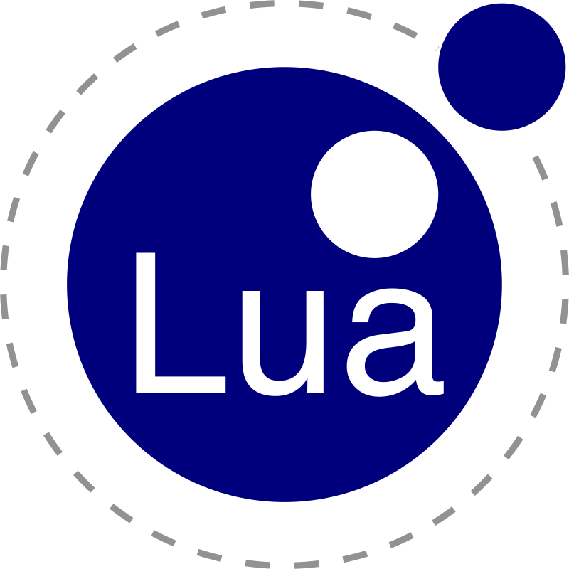

# { MasterMach50 }

 

Hello There! You seem to have reached my profile Readme.

Meet Me :
- 5 years of programming
- No professional experience
- Languages
  - Knows
    - Python 
    - JavaScript 
    - Lua 
    - AutoHotKey 
  - Learning
    - Rust 
- Frameworks / Applications
  - Knows
    - Tauri 
    - Flask 
    - Debian  
  - Learning
    - Yew 
    - django 
    - NixOS  

> Did you really read all of that?
